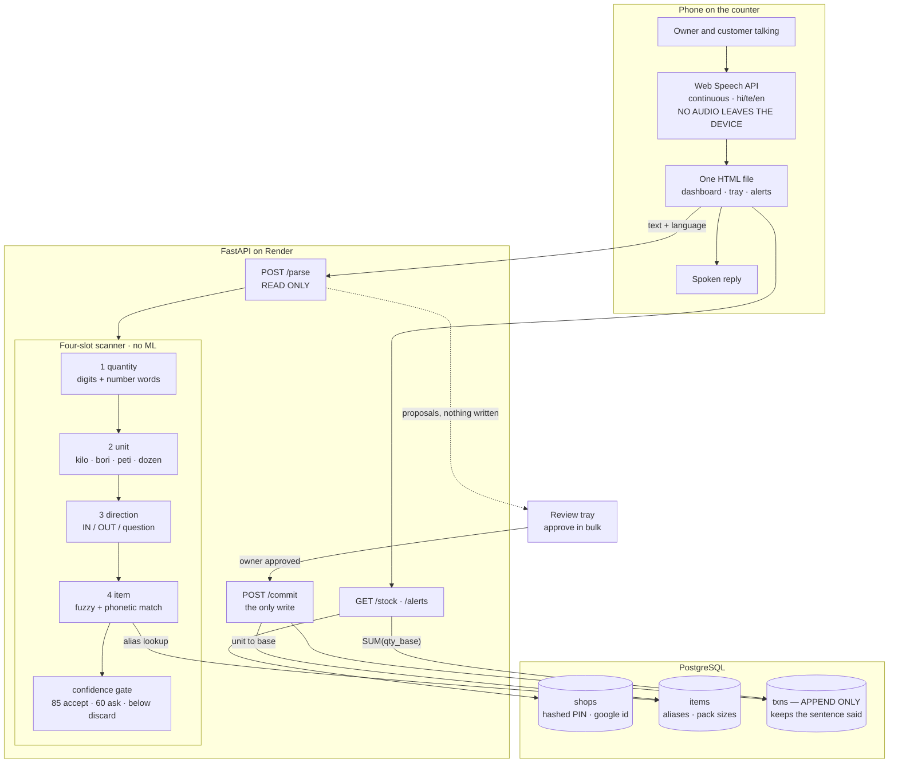

# SunoBolo — Voice-Based Inventory Management Using Conversational Speech

Leave the phone on the shop counter. It listens to the ordinary conversation between
owner and customer, and proposes the stock movements it hears. The owner approves a
batch with one tap. Hindi, Telugu and English, mixed freely in one sentence.

**Every other voice inventory app is a command interface** — you press a button and
dictate *"add twenty kilo rice."* That is still data entry, done with your mouth.
SunoBolo inverts it: a kirana shop already says every transaction out loud, twice.
That speech is a complete transaction log that currently evaporates. We capture it.

---

## Live

**https://sunobolo.onrender.com** · source: https://github.com/gourishetti-ruthvik/sunobolo

Free instance, so the first request after a quiet spell takes ~50s to wake.
Open it once a couple of minutes before you demo.

## Run it locally

Needs **Python 3.10+**. Nothing else — no Node, no build step, no database server.

```bash
pip install -r requirements.txt
```

```bash
python -m uvicorn app:app --reload --port 8000
```

Then open **http://localhost:8000**

The SQLite database is created and seeded automatically on first run. To start over,
delete `sunobolo.db` and restart.

### Speak to it

Voice needs **Chrome or Safari**, and the Web Speech API only runs on `localhost` or
`https://` — it will not work over a LAN IP like `192.168.x.x`. On `localhost` the
browser will ask once for microphone permission.

Without a microphone the app is still fully usable: the mic button falls through to a
text box that feeds the identical parsing path.

### Run the tests

```bash
python test_parse.py && python test_auth.py
```

27 parser checks and 22 auth checks. Both run in under a second.

---

## What to try

| Say (or type) | What happens |
|---|---|
| `bees kilo chawal aaya` | +20 kg Rice |
| `do bori chawal aaya` | +100 kg — per-item pack size |
| `rendu bori biyyam vacchindi` | same thing, in Telugu |
| `do kilo chawal aur ek maggi dena` | two movements from one sentence |
| `paanch kilo chowal becha` | −5 kg Rice, despite the misspelling |
| `char kilo tamatar dena` | "we don't stock this" → add it, and it remembers the word |
| `chawal kitna hai` | spoken answer, no stock change |
| `kya khatam ho raha hai` | opens the reorder list |

Turn on **Counter Mode** and just talk to a customer normally — nothing else to press.

---

## How it works

A shop has ~50 items, ~10 units, 2 directions. The answer space is tiny, so the parser
never tries to understand a sentence — it scans for four known things and looks each one
up in a list:

```
"bhaiya do kilo chawal dena"
          │   │     │     │
          │   │     │     └─ direction → OUT
          │   │     └─────── item      → fuzzy match → Rice (94%)
          │   └───────────── unit      → kg
          └───────────────── quantity  → 2
```

**One fuzzy comparison solves two problems at once.** `chowal` (a speech-to-text error)
and `biyyam` (a different language) are both just near-misses against the same alias
list — so there is no translator and no spell-checker, and no model is trained.

**Stock is never stored as a number.** Every change is an append-only row, and current
stock is `SUM(qty_base)`. History, undo and the audit trail come free, and a wrong entry
is correctable rather than already destructive.

**Nothing auto-commits.** `/parse` is read-only. Low-confidence matches are discarded
rather than guessed at, and corrections teach the lexicon — correct "tamatar" once and
it is right forever.

---

## Architecture



Speech turns to text on the phone, text becomes proposals on the server, and only a human
tap turns a proposal into a ledger row.

---

## Why these choices

| Layer | Choice | Why |
|---|---|---|
| Speech to text | Web Speech API | Free, no key, no model download, sub-second. Ships in Chrome and Safari with `hi-IN`, `te-IN`, `en-IN`. Continuous mode is what makes passive listening possible at zero cost. |
| Understanding | rapidfuzz + jellyfish | Deterministic, testable, explainable. Fuzzy distance plus phonetic codes, no training. |
| Backend | FastAPI | Little boilerplate, automatic API docs, and Python is where the NLP libraries live. |
| Database | PostgreSQL / SQLite | SQLite locally so there is nothing to install; Postgres in production so data survives restarts. One env var switches them. |
| Frontend | Vanilla JS, one file | Four screens and one list. React's value is complex state and there isn't any — dropping it removed a build step, a lockfile and ~1,400 dependency files. |
| Hosting | Render | Free tier with a *real managed database*, HTTPS by default (the Web Speech API refuses plain HTTP), and a Singapore region. One service serves both halves, so there is no CORS. |

Six dependencies. No Node, no build step, no framework.

### Deployment

One Render web service plus a managed Postgres 16 instance, both in Singapore. FastAPI
serves the static HTML and the API from the same origin. Pushing to `main` deploys;
`render.yaml` keeps the configuration reproducible. `SECRET_KEY` and `DATABASE_URL` are
environment variables — no secret is committed.

**Known limit:** the free instance sleeps after ~15 minutes idle and takes ~50s to wake.
Open the URL a couple of minutes before demoing.

### Check what is actually live

`/healthz` reports the commit it is running, so a stale deploy is visible rather than
mistaken for a broken feature:

```bash
./scripts/check_deploy.sh
```

```
local : 15100c6
live  : 15100c6
OK    : the live site is running your latest commit
```

Render auto-deploy needs a GitHub webhook, and a service created through the API does not
get one — it reports `autoDeploy: yes` and silently never fires. Fix it once in the Render
dashboard: **Settings → Build & Deploy → Repository → Connect** (authorise the Render
GitHub App for this repo). Until then, deploy with **Manual Deploy → Deploy latest commit**.

---

## How it compares

| Product | What it is | Input model |
|---|---|---|
| Vyapar | GST billing + inventory for Indian SMBs | Forms and typing; voice where present is dictation into a field |
| myBillBook | Billing and inventory, regional-language UI | Forms and typing |
| Khatabook / OkCredit | Digital *udhaar* ledger — credit, not stock | Typing; a different problem |
| Zoho Inventory | Full inventory suite | English, desktop-shaped, built for a business user not a counter |
| Alexa / Assistant skills | Voice stock entry | Wake word plus a well-formed command |
| **SunoBolo** | Voice inventory for one counter | **Overhears ordinary conversation. Nothing to press, no command to learn.** |

Every product above is an *interface you operate*. This one is an *observer*. They ask the
owner to stop and tell the app what happened; we take what the shop already said.

Two things none of them do: the lexicon **learns from corrections** — say "tamatar" once,
correct it once, and it is right forever — and trade units are **per item**, so "two bori"
is 100 kg of rice but 50 kg of sugar.

---

## Problems we hit

Each was found by measuring, not guessing.

| Problem | Cause and fix |
|---|---|
| Every delivery logged as a sale | `do` means both "two" and "give". It sat in the OUT verbs, so *"do kilo chawal aaya"* became a sale. Removed — in a shop it is overwhelmingly the number. |
| Long sentences hid misspellings | `chowal` scores **83** against `chawal`, but *"paanch kilo chowal aaya"* scores **34** — extra words dilute it. Switched to comparing word by word. |
| Tomato became wheat flour | `tamatar`→`aata` scores 72.7 — identical to the real mishearing `sawal`→`chawal`. Fuzzy score alone cannot separate them; **length ratio** can (0.57 vs 0.83). Verified on 16 pairs. |
| Weather chatter became a proposal | *"aaj bahut garmi hai"* scored exactly 60 against Sugar and the gate was `< 60`. Counter Mode now needs 75 — it hears a whole room, so it must be stricter than a button press. |
| Google sign-in failed silently | Chrome fires `onerror` then `onend`, and `onend` was closing the fallback `onerror` had just opened. Plus the deployed domain was missing from Google's origin allowlist. |
| A deploy that would have failed | `httpx` was imported but never declared in `requirements.txt`. It worked locally only because it was installed by hand. |

**The honest limitation:** passive extraction from conversation is meaningfully less
accurate than dictation — realistically 50–65% against roughly 90%. The design absorbs
that rather than hiding it: nothing auto-commits, low-confidence results are discarded
rather than shown, and Command Mode is always available. The novel capability is novel;
the failure mode is an ordinary voice inventory app.

---

## Files

| File | Lines | Does |
|---|---|---|
| `parse.py` | ~290 | Lexicons, slot scanner, fuzzy matching, confidence. The only clever file. |
| `app.py` | ~550 | FastAPI + stdlib `sqlite3`. Accounts, ledger, alerts. No ORM. |
| `index.html` | ~830 | Landing page, auth, and the whole app. Vanilla JS, no framework. |
| `test_parse.py` | ~80 | 27 assertions — the spec of what speech is supported. |
| `test_auth.py` | ~90 | 22 assertions — mostly "one shop cannot see another's stock". |

## Configuration

| Variable | Default | Purpose |
|---|---|---|
| `DATABASE_URL` | unset | A `postgresql://` URL switches the app to Postgres. Unset means SQLite. |
| `DB_PATH` | `sunobolo.db` | SQLite file location (ignored when `DATABASE_URL` is set) |
| `SECRET_KEY` | random per start | Signs session tokens. Unset means a restart signs everyone out. |
| `GOOGLE_CLIENT_ID` | built-in | Google sign-in. Unset it to hide the button; the app works fine without. |

Google sign-in needs the app's exact origin listed under *Authorized JavaScript origins*
in the Google Cloud console.

## Documents

[Requirements](docs/M1-1-Requirements-Analysis.md) ·
[Functional Requirements](docs/M1-2-Functional-Requirements.md) ·
[Technical Design](docs/M1-3-Technical-Design-Architecture.md) ·
[UI/UX](docs/M1-4-UI-UX-Design-Prototype.md) ·
[Architecture diagram](docs/architecture.mmd) (paste into mermaid.live)
