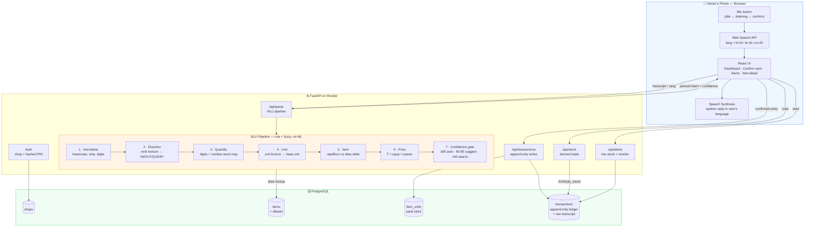

# Technical Design & Architecture
**Project:** BoloStock — Voice-Based Inventory Management
**Milestone:** 1.3 · **Date:** 19 September 2026

---

## 1. Design Thesis

Inventory speech is a **closed-world problem**. A shop's utterances are unbounded in form
but the answer space is tiny: roughly 50 items, 10 units, 4 actions. The system therefore
does not attempt to *understand sentences*. It scans a noisy transcript for four known
slots, each resolved against a finite lexicon:

```
"bees kilo chawal aa gaya, teen sau rupay kilo"
   │     │      │      │        │
   │     │      │      │        └── PRICE → 300
   │     │      │      └─────────── DIRECTION → IN
   │     │      └────────────────── ITEM → fuzzy match → Rice (94)
   │     └───────────────────────── UNIT → kg
   └─────────────────────────────── QUANTITY → 20
```

Two consequences follow, and they define the architecture:

1. **No model is trained.** The mapping a model would have to learn is small enough to be
   written down as data. Recognition is off-the-shelf; understanding is deterministic.
2. **One fuzzy matcher absorbs two different problems.** Speech-to-text error
   (`chaawal`, `chowal`) and language variation (`rice`, `चावल`, `biyyam`) are both just
   *near-misses against an alias list*. A single `rapidfuzz` call handles both, so the
   system needs neither a spell-checker nor a translator.

## 2. Technology Stack

| Layer | Choice | Rationale |
|---|---|---|
| Speech-to-text | **Web Speech API** (`webkitSpeechRecognition`) | Free, no key, no model download, sub-second, ships with Chrome/Safari and supports `hi-IN`, `te-IN`, `en-IN` |
| Text-to-speech | **Web Speech Synthesis** | Native per-locale voices; zero cost, zero latency |
| Frontend | **React 18 + Vite**, plain CSS | Mobile-first; no router or UI library — a single state value drives four screens |
| Backend | **FastAPI + SQLModel** (Python 3.11) | One class defines both the table and the API schema; automatic OpenAPI docs |
| NLU | **rapidfuzz** + lexicon tables | Deterministic, testable, inspectable, fast |
| Database | **SQLite** (dev) / **PostgreSQL** (prod) | Switched by a single `DATABASE_URL`; managed Postgres gives durable persistence |
| Hosting | **Vercel** (frontend) + **Render** (API + Postgres) | Always-on static frontend; free managed database |

**Why recognition lives in the browser.** Server-side transcription (Whisper) would add a
250 MB model, 5–15 s of CPU latency per utterance on free hosting, and a hard RAM floor.
The browser's recogniser returns a transcript in under a second at zero cost and zero
install. The intelligence that matters for this problem — the domain understanding — is
ours and lives on the server, where it is testable.

---

## 3. Architecture



**Request path for one voice entry**

```
speak → Web Speech API → transcript string
      → POST /api/parse {transcript, lang}
      → NLU returns {action, item_id, qty, unit, qty_base, price, confidence}
      → UI renders confirmation card (editable, no keyboard)
      → POST /api/transactions  ← the only write
      → new total returned → spoken + displayed
```

The parse step is deliberately **read-only**. Nothing is written until the user confirms,
so a mis-recognition can never corrupt stock.

---

## 4. Data Model

```sql
shops (
  id            INTEGER PRIMARY KEY,
  name          TEXT NOT NULL,
  pin_hash      TEXT NOT NULL,          -- sha256(pin + salt)
  lang          TEXT DEFAULT 'hi'       -- default reply language
);

items (
  id            INTEGER PRIMARY KEY,
  shop_id       INTEGER REFERENCES shops(id),
  name          TEXT NOT NULL,          -- canonical display name
  aliases       TEXT NOT NULL,          -- JSON array, all langs + ASR variants
  base_unit     TEXT NOT NULL,          -- 'kg' | 'pc' | 'litre'
  display_unit  TEXT NOT NULL,          -- what the owner prefers to see
  reorder_level REAL DEFAULT 0,         -- in base_unit
  target_level  REAL DEFAULT 0,         -- restock target, drives suggestions
  last_price    REAL
);

item_units (                            -- per-item pack sizes
  id            INTEGER PRIMARY KEY,
  item_id       INTEGER REFERENCES items(id),
  unit          TEXT NOT NULL,          -- 'bori', 'carton', 'tray'
  factor        REAL NOT NULL           -- 1 unit = factor × base_unit
);

transactions (                          -- append-only ledger
  id            INTEGER PRIMARY KEY,
  shop_id       INTEGER REFERENCES shops(id),
  item_id       INTEGER REFERENCES items(id),
  direction     TEXT NOT NULL,          -- 'in' | 'out'
  qty_spoken    REAL NOT NULL,          -- 2
  unit_spoken   TEXT NOT NULL,          -- 'bori'
  qty_base      REAL NOT NULL,          -- 100  (signed: negative for 'out')
  price         REAL,
  transcript    TEXT,                   -- exact words spoken — audit trail
  lang          TEXT,
  confidence    REAL,
  source        TEXT,                   -- 'voice' | 'manual' | 'undo'
  created_at    TIMESTAMP DEFAULT now()
);
```

### 4.1 Stock is derived, never stored

```sql
SELECT item_id, SUM(qty_base) AS stock FROM transactions GROUP BY item_id;
```

This single decision delivers four requirements at once:

- **Transaction history** — it *is* the storage format, not a parallel log
- **Undo** — insert a reversing row; nothing is ever deleted
- **Audit / logging** — every number traces to the sentence that produced it
- **Correction safety** — a mis-parse is amendable, never destructive

> `ponytail:` stock is recomputed by aggregate on every read. Correct and trivially
> consistent at shop scale (thousands of rows). Add a cached `stock` column with a trigger
> only if a shop ever crosses ~100k transactions.

### 4.2 Unit conversion — two layers

**Global units** are universal and hard-coded:

| From | To base | Factor |
|---|---|---|
| gram | kg | 0.001 |
| quintal | kg | 100 |
| dozen | pc | 12 |
| tray (eggs) | pc | 30 |
| ml | litre | 0.001 |

**Per-item pack sizes** live in `item_units`, because they are genuinely item-specific:

| Item | Unit | Factor |
|---|---|---|
| Rice | bori | 50 kg |
| Sugar | bag | 25 kg |
| Maggi | carton | 96 pc |
| Sunflower oil | tin | 15 litre |

Resolution order: per-item table → global table → item's base unit. Every transaction
stores **both** the spoken unit and the base-unit value, so the owner can speak in *bori*,
the database can reason in kilograms, and the UI can display either.

---

## 5. The NLU Pipeline

Input: a raw transcript and a language hint. Output: a structured intent with a confidence
score. Pure function — no I/O beyond reading the shop's item catalogue, therefore fully
unit-testable.

**Step 1 — Normalise.** Lowercase, strip punctuation, collapse whitespace. Devanagari and
Telugu scripts pass through unchanged; the matcher is script-agnostic.

**Step 2 — Direction.** Scan for verb keywords anywhere in the string:

| Intent | Keywords (hi / te / en) |
|---|---|
| IN | aaya, aa gaya, aayi, liya, kharida, mangwaya · vacchindi, konnanu, techanu · came, bought, received, add, in |
| OUT | gaya, becha, bech diya, diya, nikala · ammanu, ammesanu, poyindi, ichanu · sold, sale, out, remove |
| QUERY_ITEM | kitna, kitne, kitni, bacha, batao · enta, entha, unnayi, cheppu · how much, how many, stock |
| QUERY_LOW | khatam, kam, mangwana · takkuva, avvali · running low, finished, order |

Priority: QUERY_LOW → QUERY_ITEM → OUT → IN. IN is the default when nothing matches, since
the most common spoken entry is a delivery arriving.

**Step 3 — Quantity.** Digits are taken directly. Number words are resolved from a map
covering 1–100 plus `sau`/`hazaar`/`nooru`/`veyyi`, with multiplier composition
("teen sau" → 3 × 100), and the fractional trade words `dhai` 2.5, `derh` 1.5, `sawa` 1.25,
`paune` 0.75. Absent quantity defaults to 1.

**Step 4 — Unit.** Matched against the combined unit lexicon (all languages, singular and
plural). Absent unit falls back to the item's base unit.

**Step 5 — Item.** The load-bearing step. Remaining tokens are matched with
`rapidfuzz.process.extract` using `token_set_ratio` against every alias of every item in
the shop. The same lookup simultaneously absorbs:

- **ASR noise** — `chaawal`, `chowal`, `chawl` → Rice
- **Language variation** — `rice`, `chawal`, `चावल`, `biyyam`, `బియ్యం` → Rice
- **Partial phrases** — `sunflower oil`, `tel`, `nune` → Sunflower Oil

This is why no translation layer and no spell-correction layer exist: both problems are the
same problem, and one similarity search solves them.

**Step 6 — Price.** Number adjacent to `rupay`, `rupees`, `₹`, `rs`, `rupayalu`.

**Step 7 — Confidence gate.**

| Item score | UI behaviour |
|---|---|
| ≥ 85 | Confirmation card pre-filled, one tap to commit |
| 60–85 | Best match shown with the next two candidates as one-tap chips |
| < 60 | Item search opens; the system does not guess |
| Top two within 5 points | Forced "Did you mean?" regardless of absolute score |

The confidence gate is where a probabilistic matcher is made safe, and it is
simultaneously the manual-correction feature required by FR-4.

---

## 6. API Surface

| Method | Route | Purpose |
|---|---|---|
| `POST` | `/api/login` | Shop name + PIN → session token |
| `POST` | `/api/parse` | `{transcript, lang}` → parsed intent + confidence. **Read-only** |
| `POST` | `/api/transactions` | Commit a confirmed entry; returns the new total |
| `POST` | `/api/transactions/{id}/undo` | Insert the reversing row |
| `GET` | `/api/stock` | All items with derived current quantity and status |
| `GET` | `/api/items/{id}` | Item detail with pack sizes and recent history |
| `GET` | `/api/items/search?q=` | Alias search across all three languages |
| `POST` | `/api/items` | Add an item to the catalogue |
| `GET` | `/api/alerts` | Low-stock list with reorder suggestions |
| `GET` | `/api/export.csv` | Full ledger export (backup) |

FastAPI generates interactive OpenAPI docs at `/docs` from the same SQLModel classes.

---

## 7. Non-Functional Design

**Authentication.** Shop name plus a 4-digit PIN, stored as a salted SHA-256 hash. The
session token is kept in `localStorage`. A 4-digit PIN is the correct control for a
single-operator shop app — it is memorable and does not require a keyboard.
> `ponytail:` PIN + hash meets the brief's "basic authentication". Move to bcrypt and
> short-lived JWTs before any real multi-tenant deployment.

**Backup.** Managed Postgres provides durability; `/api/export.csv` gives the owner an
independent copy of the full ledger.

**Logging.** Every parse is logged with its transcript, chosen item, score, and whether the
user corrected it. This is both an operational log and the feedback signal for extending
the alias lexicon — the corrections tell you exactly which aliases are missing.

**Degradation.** If the Web Speech API is unavailable, the transcript field becomes a text
input feeding the identical `/api/parse` endpoint. The fallback is not a separate code
path; it is the manual-correction feature of FR-4.5.

**Accessibility.** Minimum 48 px touch targets, status conveyed by colour *and* icon *and*
text, system font stack with Devanagari and Telugu coverage, all actions reachable one-handed.

---

## 8. Quality Assurance

| Layer | Approach |
|---|---|
| NLU | `test_parser.py` — a table of utterances across all three languages asserted against expected intents. The parser is a pure function, so this runs in under a second |
| Unit conversion | Assertions on the per-item and global factor chain, including the *"2 bori rice = 100 kg"* case |
| API | FastAPI `TestClient` over the commit-then-read path |
| End-to-end | Scripted manual run on a real phone against the deployed URL |

The parser test table doubles as the specification of supported phrasing, and grows
directly from the correction log described above.

---

## 9. Deployment

```
Vercel  ──  React static build  ──  https://bolostock.vercel.app
   │                                        │ HTTPS required by the Web Speech API
   └── VITE_API_URL ──────────────────────► │
                                   Render ── FastAPI (CORS-allowed origin)
                                        └──  Render managed PostgreSQL
```

The frontend is a static bundle on an always-on CDN, so the first screen never waits on a
cold start. The API is stateless; all durable state is in Postgres.
