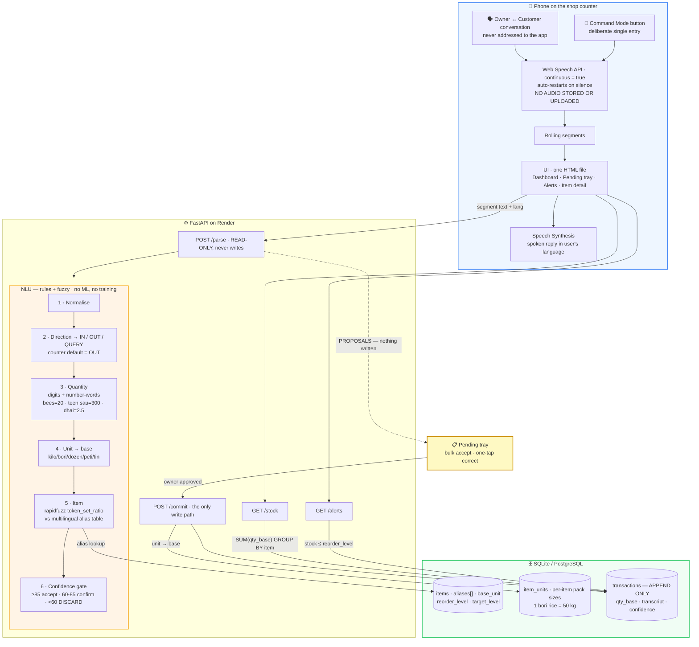

# BoloStock — Voice-Based Inventory Management for Small Businesses

# Milestone 1.3 · Technical Design & Architecture

**Deliverable:** Technical Document + Architecture Diagram
**Date:** 19 September 2026
**Prepared by:** ______________________________

---

## Project Context

**BoloStock** is a voice-first inventory system for small Indian retail shops.

Every voice inventory product on the market works as a **command interface**: you press a
button and issue a structured instruction — *"add twenty kilo rice."* That is still data
entry, performed with your mouth instead of your thumbs. BoloStock inverts this. The phone
sits on the shop counter and **listens to the shop**, extracting stock movements from the
ordinary conversation between owner and customer — sentences that were never addressed to
the app at all. A kirana shop already says every transaction out loud, usually twice: once
when the customer asks and once when the owner confirms. That speech is a complete, free
transaction log that currently evaporates into the air. **BoloStock captures it.**

Because passive capture is less accurate than dictated commands, nothing it extracts is
written to stock automatically. Every extraction becomes a **proposal** the owner approves
in bulk, and a conventional **Command Mode** mic button remains available as the reliable
path. The novel capability is genuinely novel; the failure mode is an ordinary voice
inventory app.

### Milestone 1 deliverables

- **1.1** — Requirements Gathering & Analysis
- **1.2** — Functional Requirements
- **1.3** — Technical Design & Architecture  *(this document)*
- **1.4** — UI/UX Design & Prototype

---
---

# Technical Design & Architecture

## 1. Design Thesis

Inventory speech is a **closed-world problem**. A shop's utterances are unbounded in form,
but the answer space is tiny: roughly 50 items, 10 units, 4 actions. The system therefore
never attempts to *understand sentences*. It scans a noisy transcript for four known slots,
each resolved against a finite lexicon:

```
"bhaiya do kilo chawal dena"
          │   │     │     │
          │   │     │     └── DIRECTION → OUT
          │   │     └──────── ITEM → fuzzy match → Rice (94)
          │   └────────────── UNIT → kg
          └────────────────── QUANTITY → 2
```

Three consequences follow, and they define the architecture:

1. **No model is trained.** The mapping a model would have to learn is small enough to write
   down as data. Recognition is off-the-shelf; understanding is deterministic and testable.

2. **One fuzzy matcher absorbs two different problems.** Speech-recognition error
   (`chaawal`, `chowal`) and language variation (`rice`, `चावल`, `biyyam`) are both just
   *near-misses against an alias list*. A single `rapidfuzz` call handles both — so the system
   needs neither a spell-checker nor a translator. **This is the whole trick.**

3. **Because passive capture is unreliable, nothing it produces may auto-commit.** The parse
   step is read-only by construction. This converts a probabilistic component into a safe one:
   the worst outcome of a bad extraction is one dismissed card, never a corrupted ledger.

## 2. Technology Stack

| Layer | Choice | Rationale |
|---|---|---|
| Speech-to-text | **Web Speech API** (`webkitSpeechRecognition`, `continuous = true`) | Free, no key, no model download, sub-second; supports `hi-IN`, `te-IN`, `en-IN`. Continuous mode is what makes passive capture possible at zero cost |
| Text-to-speech | **Web Speech Synthesis** | Native per-locale voices, zero cost |
| Frontend | **Single HTML file, vanilla JS, plain CSS** | No framework, no build step, no `node_modules`. The entire UI is one readable file |
| Backend | **FastAPI** (Python 3.11) | Automatic OpenAPI docs; minimal boilerplate |
| Database | **`sqlite3` from the standard library** (dev) / **PostgreSQL** (prod) | No ORM. The schema is four tables and the queries are short enough to read directly |
| NLU | **`rapidfuzz`** + lexicon tables | Deterministic, testable, inspectable, fast |
| Hosting | **Render** — one service, FastAPI serves the HTML | Single deploy, single origin, no CORS |

**Why recognition lives in the browser.** Server-side transcription (Whisper) would add a
250 MB model, 5–15 s of CPU latency per utterance on free hosting, and a hard RAM floor —
and continuous listening would make that cost permanent. The browser recogniser returns text
in under a second at zero cost, with **no audio ever leaving the device**, which is also what
makes the privacy position defensible.

**Why no frontend framework.** The app has four screens and one list that updates. React's
value is managing complex state; there isn't any here. Dropping it removes a build step, a
lockfile, 1,400 dependency files, and roughly 300 lines of code.

## 3. Architecture Diagram



**The request path for one overheard sale:**

```
conversation → continuous recognition → segment text
             → POST /parse {text, lang}            ← READ-ONLY
             → proposals [{item, qty, unit, dir, confidence}]
             → pending tray (nothing written yet)
             → owner taps accept → POST /commit    ← the only write
             → new total returned → spoken + displayed
```

## 4. Data Model

```sql
items (
  id            INTEGER PRIMARY KEY,
  name          TEXT NOT NULL,          -- canonical display name
  aliases       TEXT NOT NULL,          -- JSON array: all langs + ASR misspellings
  base_unit     TEXT NOT NULL,          -- 'kg' | 'pc' | 'litre'
  reorder_level REAL DEFAULT 0,         -- in base_unit
  target_level  REAL DEFAULT 0,         -- restock target, drives suggestions
  last_price    REAL
);

item_units (                            -- per-item pack sizes
  item_id       INTEGER REFERENCES items(id),
  unit          TEXT NOT NULL,          -- 'bori', 'carton', 'tray'
  factor        REAL NOT NULL           -- 1 unit = factor × base_unit
);

transactions (                          -- append-only ledger
  id            INTEGER PRIMARY KEY,
  item_id       INTEGER REFERENCES items(id),
  qty_spoken    REAL NOT NULL,          -- 2
  unit_spoken   TEXT NOT NULL,          -- 'bori'
  qty_base      REAL NOT NULL,          -- +100, or negative for 'out'
  price         REAL,
  transcript    TEXT,                   -- exact words heard — audit trail
  lang          TEXT,
  confidence    REAL,
  source        TEXT,                   -- 'counter' | 'command' | 'manual' | 'undo'
  created_at    TIMESTAMP DEFAULT CURRENT_TIMESTAMP
);

shops (id, name, pin_hash, lang);
```

### 4.1 Stock is derived, never stored

```sql
SELECT item_id, SUM(qty_base) AS stock FROM transactions GROUP BY item_id;
```

One decision delivers four requirements at once:

- **Transaction history** — it *is* the storage format, not a parallel log
- **Undo** — insert a reversing row; nothing is ever deleted
- **Audit trail** — every number traces to the sentence that produced it
- **Correction safety** — a mis-parse is amendable, never destructive

*Ceiling:* stock is recomputed by aggregate on every read. Correct and trivially consistent at
shop scale. A cached column with a trigger is warranted only past ~100k transactions.

### 4.2 Unit conversion — two layers

**Global units**, universal and hard-coded: `gram → kg ×0.001`, `quintal → kg ×100`,
`dozen → pc ×12`, `tray → pc ×30`, `ml → litre ×0.001`.

**Per-item pack sizes** live in `item_units`, because they are genuinely item-specific:

| Item | Unit | Factor |
|---|---|---|
| Rice | bori | 50 kg |
| Sugar | bag | 25 kg |
| Maggi | carton | 96 pc |
| Sunflower oil | tin | 15 litre |

Resolution order: per-item → global → item's base unit. Every transaction stores **both** the
spoken unit and the base-unit value, so the owner speaks in *bori*, the database reasons in
kilograms, and the UI displays either.

## 5. The NLU Pipeline

Input: transcript plus a language hint. Output: zero or more structured movements with
confidence scores. A pure function over the item catalogue — therefore fully unit-testable.

**Step 1 — Normalise.** Lowercase, strip punctuation, collapse whitespace. Devanagari and
Telugu pass through unchanged; the matcher is script-agnostic.

**Step 2 — Direction.**

| Intent | Keywords (hi / te / en) |
|---|---|
| IN | aaya, aa gaya, liya, kharida, mangwaya · vacchindi, konnanu · came, bought, received, add |
| OUT | dena, de do, becha, diya, nikala, chahiye · kavali, ammanu, ichanu · sold, give, need |
| QUERY_ITEM | kitna, kitne, bacha, batao · enta, unnayi, cheppu · how much, how many |
| QUERY_LOW | khatam, kam, mangwana · takkuva · running low, finished, order |

Priority QUERY_LOW → QUERY_ITEM → IN → OUT. **In Counter Mode the default is OUT**, because
counter conversation is overwhelmingly selling; in Command Mode the default is IN, because
deliberate entries are usually deliveries.

**Step 3 — Quantity.** Digits taken directly. Number words resolved from a map covering 1–100
plus *sau/hazaar/nooru/veyyi*, with multiplier composition (*"teen sau"* → 3 × 100) and the
fractional trade words *dhai* 2.5, *derh* 1.5, *sawa* 1.25, *paune* 0.75. Absent → 1.

**Step 4 — Unit.** Matched against the combined unit lexicon in all languages, singular and
plural. Absent → the item's base unit.

**Step 5 — Item.** The load-bearing step. `rapidfuzz.process.extract` with `token_set_ratio`
against every alias of every item. One lookup simultaneously absorbs:

- **ASR noise** — `chaawal`, `chowal`, `chawl` → Rice
- **Language variation** — `rice`, `chawal`, `चावल`, `biyyam`, `బియ్యం` → Rice
- **Partial phrases** — `sunflower oil`, `tel`, `nune` → Sunflower Oil

This is precisely why there is no translation layer and no spell-correction layer: both are
the same problem, and one similarity search solves it.

**Step 6 — Multi-item split.** The segment is split on conjunctions (*aur*, *and*, *mariyu*)
and each fragment parsed independently, so one sentence can yield several movements.

**Step 7 — Confidence gate.** Scores map to the behaviour table in FR-4.3 of the Functional Requirements document. In Counter Mode
anything below 60 is **discarded silently** rather than shown — the cost of a false proposal
is the owner's attention, and attention is the scarce resource being protected.

## 6. API Surface

| Method | Route | Purpose |
|---|---|---|
| `POST` | `/parse` | `{text, lang, mode}` → proposals + confidence. **Read-only** |
| `POST` | `/commit` | Write one approved movement; returns the new total |
| `POST` | `/commit/bulk` | Write all approved proposals in one call |
| `POST` | `/undo/{id}` | Insert the reversing row |
| `GET` | `/stock` | All items with derived quantity and status |
| `GET` | `/alerts` | Low-stock list with reorder suggestions |
| `GET` | `/item/{id}` | Detail with pack sizes and recent history |
| `GET` | `/export.csv` | Full ledger export (backup) |
| `POST` | `/login` | Shop name + PIN → session token |

## 7. Non-Functional Design

**Privacy.** Recognition is browser-local; no audio is recorded, stored or uploaded. Only the
extracted values and the resulting transcript reach the server. Counter Mode displays an
unmistakable listening indicator whenever it is active.

**Authentication.** Shop name plus a 4-digit PIN stored as a salted SHA-256 hash; session
token in `localStorage`. A 4-digit PIN is the right control for a single-operator shop app —
memorable, and no keyboard.
*Ceiling:* move to bcrypt and short-lived JWTs before any real multi-tenant deployment.

**Logging.** Every parse is logged with its transcript, chosen item, score, and whether the
owner corrected it. This is both an operational log and the feedback signal for extending the
alias lexicon — the corrections name exactly which aliases are missing.

**Degradation.** Without the Web Speech API the transcript field becomes a text input feeding
the identical `/parse` endpoint. The fallback is not a separate code path; it is the manual-entry requirement (FR-4.6 of the Functional Requirements document).

**Accessibility.** 48 px minimum touch targets; status conveyed by colour *and* icon *and*
text; system font stack with Devanagari and Telugu coverage; one-handed operation.

## 8. Quality Assurance

| Layer | Approach |
|---|---|
| NLU | `test_parse.py` — a table of utterances across all three languages asserted against expected extractions. The parser is a pure function, so the suite runs in under a second |
| Unit conversion | Assertions on the per-item and global factor chain, including *"2 bori rice = 100 kg"* |
| API | FastAPI `TestClient` over the commit-then-read path |
| End-to-end | Scripted manual run on a real phone against the deployed URL, including a performed counter conversation |

The parser test table doubles as the specification of supported phrasing, and grows directly
from the correction log above.

## 9. Deployment

One Render web service. FastAPI serves the static HTML and the API from the same origin — no
CORS, no separate frontend deploy, no build step. PostgreSQL is a managed Render add-on;
`DATABASE_URL` switches between it and local SQLite.

The Web Speech API requires HTTPS, which Render provides.

## 10. Code Budget

| File | Lines | Responsibility |
|---|---|---|
| `parse.py` | ~110 | Lexicon, slot scanner, fuzzy matching, confidence — **the only clever file** |
| `app.py` | ~130 | FastAPI routes, `sqlite3` access, seed data |
| `index.html` | ~190 | Entire UI + continuous listener, no framework |
| `test_parse.py` | ~25 | Parser assertions |
| **Total** | **~455** | No build step, no lockfile, no `node_modules` |

---

## Appendix — Honest Assessment of Risk

The passive-capture approach is deliberately more ambitious than command-mode voice entry,
and it is weaker in one specific respect: **extraction accuracy from unstructured
conversation will be materially lower than from deliberate commands** — realistically 50–65%
against roughly 90%.

This is designed around rather than hidden:

- Counter Mode **proposes**; it never commits. A wrong extraction costs one dismissive tap.
- Below-threshold extractions are discarded rather than shown, so the tray stays trustworthy.
- **Command Mode remains available at all times** as the reliable path. The passive feature is
  the differentiator; the command path is the floor the product cannot fall through.

The result is a system whose novel capability is genuinely novel, and whose failure mode is
an ordinary, well-understood voice inventory app.
