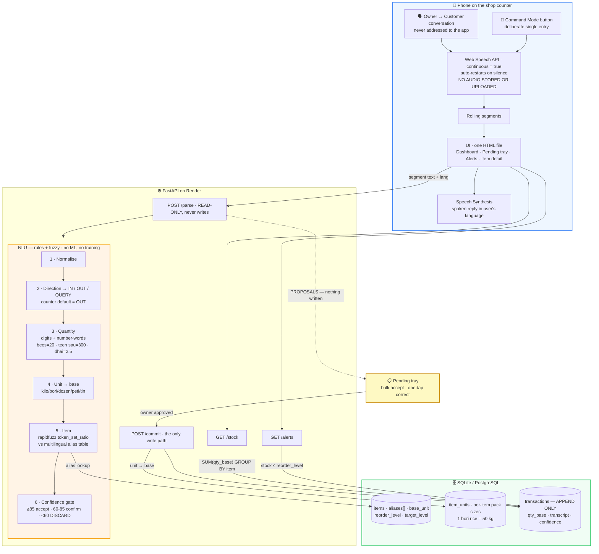

# Milestone 1 — Complete Submission
# SunoBolo — Voice-Based Inventory Management Using Conversational Speech

**Date:** 19 September 2026 · **Team:** Solo build
**Contents:** 1.1 Requirements · 1.2 Functional Requirements · 1.3 Technical Design & Architecture · 1.4 UI/UX Design & Prototype

---

## The Core Idea, in One Paragraph

Every voice inventory product on the market works as a **command interface**: you press a
button and issue a structured instruction — *"add twenty kilo rice."* That is still data
entry, performed with your mouth instead of your thumbs. SunoBolo inverts this. The phone
sits on the shop counter and **listens to the shop**, extracting stock movements from the
ordinary conversation between owner and customer — sentences that were never addressed to
the app at all. A kirana shop already says every transaction out loud, usually twice: once
when the customer asks and once when the owner confirms. That speech is a complete,
free transaction log that currently evaporates into the air. **SunoBolo captures it.**

---
---

# 1.1 · Requirements Gathering & Analysis

## 1. Problem Context

India has roughly 13 million kirana and small trade shops. The overwhelming majority track
stock in one of three ways: a paper notebook (*bahi khata*), the owner's memory, or ad-hoc
WhatsApp messages to a supplier. All three fail identically — **the record is not
queryable.** The owner cannot answer "how much rice is left?" without walking to the
godown, and cannot answer "what do I need to order?" at all until something has already
run out.

Existing digital inventory software does not solve this, because it moves the work to a
keyboard. It assumes the operator can type, can type in English, can read terms like *SKU*,
*variant*, and *reorder point*, and has patience for a multi-field form per entry. An owner
logging 40 stock movements a day will not do this.

**Voice-command inventory apps are a partial fix, and they are already widely available.**
They remove the keyboard but keep the *interruption*: the owner must stop serving, open the
app, tap a button, and speak a well-formed sentence. In a shop with a queue at the counter,
that interruption is the reason the feature goes unused after week one.

**The observation that drives this project:** the transaction has already been spoken aloud,
in natural language, by two people, before any app was opened. The data-entry step is
redundant. The system should listen instead of asking.

## 2. Target Users

| Persona | Profile | Primary need |
|---|---|---|
| **Ramesh, 48 — kirana owner, Tier-2 city** | 8th standard, fluent Hindi, minimal English, Android phone, uses WhatsApp voice notes daily | Stock to be recorded *without stopping work* |
| **Lakshmi, 35 — provisions store, Telangana** | Speaks Telugu with English product names mixed in, reads numerals but not English words | Know what is running out before customers ask |
| **Arjun, 22 — owner's son, does the ordering** | Comfortable with apps | A reliable reorder list, not a guess |

**Common denominator:** all three are fluent *speakers*, reluctant *typists*, and — critically
— **already narrate every sale out loud as part of doing business.**

## 3. Evidence Basis

Requirements derive from the GigPoint problem statement and three observable behaviours:

1. **The transaction is spoken before it is recorded.** A counter sale is a verbal exchange:
   the customer names the item and quantity, the owner confirms. This happens 100% of the
   time, with no prompting and no app.
2. **Speech is code-switched, not monolingual.** A real utterance is *"do carton Maggi dena"*
   — a Hindi numeral, an English trade unit, a brand name, a Hindi verb. Any system demanding
   one language per sentence will be abandoned.
3. **Trade units are the mental model.** Stock is thought of in *bori*, *peti*, *dozen*, *tin*,
   *quintal*. Forcing entry in kilograms makes the owner do arithmetic — exactly the friction
   being removed.

## 4. Current-State Pain → Requirement Mapping

| Pain observed | Consequence | Requirement generated |
|---|---|---|
| Entry requires typing | Stock logged late or never | R1 — voice as primary input |
| Even voice entry interrupts serving | Feature abandoned after initial novelty | **R2 — passive capture; zero interaction in the happy path** |
| Software is English-only | Owner needs a helper to operate it | R3 — regional + mixed-language input |
| Units forced to kg/pieces | Mental arithmetic on every entry | R4 — accept trade units, convert internally |
| No visibility of totals | Shortages found at point of sale | R5 — at-a-glance dashboard |
| No reorder signal | Over-ordering and stockouts together | R6 — threshold alerts + reorder list |
| Speech recognition is imperfect | A wrong entry silently corrupts stock | **R7 — nothing auto-commits; propose, then bulk-approve** |
| Notebook can be lost | Total history loss | R8 — durable server-side persistence + history |

## 5. Scope

### In scope (v1, delivered today)
- **Counter Mode** — continuous passive listening that proposes stock movements from
  overheard conversation
- **Command Mode** — a mic button for deliberate, single, well-formed entries
- Hindi, Telugu and Indian-English input, freely mixed within one sentence
- Trade-unit entry with per-item conversion to a base unit
- Pending-proposal tray with bulk accept/reject
- Stock dashboard, low-stock alerts, reorder suggestions in purchase units
- Spoken and written confirmation in the owner's language
- Full transaction history retaining the original transcript per entry
- Server-side persistence

### Out of scope (explicitly deferred)
Billing and GST invoicing · customer credit (*udhaar*) ledger · multi-shop and staff roles ·
barcode or image entry · offline-first sync · demand forecasting beyond a threshold rule ·
supplier ordering integration · speaker diarisation (telling owner and customer apart)

## 6. Constraints

| Constraint | Consequence for design |
|---|---|
| Zero budget | No paid speech APIs; browser-native recognition only |
| No model training or fine-tuning | Recognition off-the-shelf; understanding rule-based and fuzzy-matched |
| Single developer, one working day | Narrow and vertically complete, not broad |
| Low-digital-literacy users | No software jargon in any visible string; 48 px minimum touch targets |
| Low-end Android, patchy network | Mobile-first, small payloads, graceful degradation to typed input |
| Counter device is on a charger | Continuous listening is acceptable; a pocket app it is not |

## 7. Assumptions

1. The shop has a smartphone with Chrome (Android) or Safari (iOS) and intermittent internet.
2. A shop stocks 20–100 distinct items — small enough for exhaustive matching against a
   per-shop catalogue rather than open vocabulary.
3. Counter conversations are audible to a phone placed on the counter.
4. Pack sizes (*1 bori rice = 50 kg*) are configured once at setup and change rarely.
5. The owner will review a batch of proposals once or twice a day, rather than confirm each
   entry in the moment.

## 8. Risks

| Risk | Likelihood | Impact | Mitigation |
|---|---|---|---|
| **Passive extraction accuracy is low** | **High** | **High** | Nothing auto-commits. Proposals go to a review tray; a wrong proposal costs one tap to dismiss, not a corrupted ledger |
| Conversation contains no usable transaction | High | Low | Low-confidence output is discarded silently rather than shown |
| Continuous recognition stops on silence or tab blur | High | Medium | Restart-on-end loop; a visible "listening" indicator so the owner can see it died |
| Browser lacks Web Speech API | Medium | High | Editable transcript field feeds the identical parse endpoint |
| Privacy objection to listening at the counter | Medium | High | Recognition runs in the browser; **no audio is recorded, stored or uploaded** — only extracted `(item, qty, direction)` values |
| Battery drain / constant network | High | Medium | Positioned as a counter-side device on a charger |
| Ambiguous unit ("1 bag") | Medium | Medium | Pack size stored per item; unknown unit triggers a clarification chip |

## 9. Success Criteria

On a live phone against the deployed URL:

1. A performed counter conversation produces at least one correct stock proposal without any
   button being pressed.
2. A Telugu–English mixed sentence is parsed correctly for item, quantity and unit.
3. A trade unit (*"do bori"*) is stored correctly converted to the base unit.
4. Every proposal can be accepted or corrected without opening the keyboard.
5. "What is running low?" returns a correct, spoken answer.
6. Stock totals survive a page reload and a server restart.

## 10. Non-Goals

This is **not** a general-purpose voice assistant. It deliberately understands a closed
domain — the items in one shop's catalogue plus a fixed set of trade units and actions. That
narrowness is precisely why it can be accurate without any trained model, and it is a design
decision rather than a limitation of the timeline.

---
---

# 1.2 · Functional Requirements

Priority: **P0** must ship · **P1** if time allows · **P2** documented, deferred

## FR-1 — Counter Mode: Passive Voice Capture  `P0`

**FR-1.1** A single toggle starts Counter Mode. While active, the app listens continuously
and shows a persistent visual indicator that it is listening. No further interaction is
required for the rest of the session.

**FR-1.2** Speech is transcribed in rolling segments. Each completed segment is parsed
independently for stock movements. Segments containing no recognisable item are discarded
silently — the app does not clutter the tray with noise.

**FR-1.3** One segment may yield **multiple** movements. *"do kilo chawal aur ek Maggi dena"*
produces two proposals from one utterance.

**FR-1.4** Nothing extracted in Counter Mode is written to stock. Every extraction becomes a
**proposal** in the pending tray, carrying its confidence score and the sentence it came from.

**FR-1.5** Counter Mode restarts recognition automatically when the browser ends a session on
silence, so that listening survives quiet periods without user action.

**Acceptance:** With Counter Mode on and no buttons pressed, speaking *"bhaiya do kilo chawal
dena"* places a proposal reading Rice, 2, kg, OUT in the tray within 3 seconds.

## FR-2 — Command Mode: Deliberate Entry  `P0`

**FR-2.1** A mic button accepts a single, deliberate utterance for a well-formed entry —
used for goods received, for corrections, and as the reliable path when the counter is noisy.

**FR-2.2** Command Mode understands four intents:

| Intent | Meaning | Example |
|---|---|---|
| `STOCK_IN` | Goods received | *"bees kilo chawal aaya"* |
| `STOCK_OUT` | Goods sold | *"do dozen anda becha"* |
| `QUERY_ITEM` | Stock of one item | *"chawal kitna hai"* |
| `QUERY_LOW` | What needs reordering | *"kya khatam ho raha hai"* |

**FR-2.3** Command Mode results are shown on a confirmation card and committed on one tap.
Because the utterance is deliberate and well-formed, accuracy here is materially higher than
in Counter Mode, which is why it remains the reliable floor beneath the passive feature.

**Acceptance:** *"bees kilo chawal aaya"* produces a confirmation card reading Rice, 20, kg,
IN within 3 seconds of speech ending.

## FR-3 — Regional and Mixed-Language Speech  `P0`

**FR-3.1** Hindi (`hi-IN`), Telugu (`te-IN`), Indian English (`en-IN`), chosen by a persistent
three-way picker that sets both the recognition locale and the language of all replies.

**FR-3.2** Within one utterance the item, the unit and the verb may each independently be in a
different language. Matching is per-token against a multilingual alias list; the sentence is
never required to be monolingual.

**FR-3.3 Trade units** understood in all three languages, singular and plural:

| Base | Accepted trade units |
|---|---|
| `kg` | kilo, kilogram, किलो, కిలో, gram, quintal, क्विंटल, bag, bori, बोरी, గోను |
| `pc` | piece, nag, नग, dozen, दर्जन, డజను, carton, peti, पेटी, box, dabba, डब्बा, tray |
| `litre` | litre, liter, लीटर, లీటరు, ml, tin |

**FR-3.4 Number words** — *ek/do/teen/paanch/bees/sau*, *okati/rendu/moodu/aidu/nooru* —
including compounds (*"teen sau"* → 300) and fractional trade words *dhai* 2.5, *derh* 1.5,
*sawa* 1.25, *paune* 0.75.

**FR-3.5 Replies** are rendered and spoken in the selected language using plain trade
vocabulary. No software terms (*record, entry, transaction, SKU, sync*) appear anywhere.

**Acceptance:** *"rendu bori biyyam vacchindi"* registers +100 kg of Rice and the app replies
in Telugu with the new total.

## FR-4 — Pending Tray, Correction and Search  `P0`

**FR-4.1** All Counter Mode proposals collect in a tray, newest first, each showing the item,
quantity, unit, direction, confidence, and the sentence it was extracted from.

**FR-4.2 Bulk approval.** A single control accepts every proposal above the confidence
threshold. Reviewing twenty proposals takes seconds; typing twenty entries does not.

**FR-4.3 Confidence gate.**

| Item match score | Behaviour |
|---|---|
| ≥ 85 | Proposal shown ready to accept; included in bulk-accept |
| 60–85 | Shown with the next two candidate items as one-tap alternatives; excluded from bulk-accept |
| < 60 | Discarded silently — the system does not guess in passive mode |
| Top two within 5 points | Forced "did you mean" regardless of absolute score |

**FR-4.4 Tap correction.** Quantity, unit, item and direction are each individually editable.
Quantity uses steppers, unit and direction use chips, item uses the search list. No keyboard.

**FR-4.5 Item search** filters the catalogue by any alias in any language, so *"rice"*,
*"chawal"* and *"బియ్యం"* all find the same item.

**FR-4.6 Manual entry** provides a typed path to the same confirmation card, for noisy
environments and unsupported browsers, writing through the identical parse and commit path.

**Acceptance:** A misheard proposal is corrected to the right item and accepted using taps
only, with the on-screen keyboard never appearing.

## FR-5 — Dashboard, Alerts and Reorder Suggestions  `P0`

**FR-5.1** The home screen lists every item with its current quantity in the item's display
unit, sorted so items needing attention appear first, each with a status colour: green
healthy, amber low, red out.

**FR-5.2** An item is *low* when `current_qty <= reorder_level`. Low items are counted in a
home-screen banner and listed in full on the Alerts screen.

**FR-5.3** Each low item carries a reorder suggestion restoring stock to a target level,
expressed in the item's natural **purchase** unit — *"order 2 bori"*, not *"order 100 kg"*.

**FR-5.4 Item detail** shows current stock, pack sizes, reorder level, last price, and recent
transaction history — each entry showing what was said, when, and the resulting change.

**Acceptance:** Rice at 40 kg with reorder level 50 appears amber, is counted in the banner,
and suggests "order 2 bori (100 kg)".

## FR-6 — Clear Confirmations and Summaries  `P0`

**FR-6.1** After a commit the app states what changed and the new total, on screen and aloud —
*"20 किलो चावल जोड़ा गया। अब स्टॉक 145 किलो।"*

**FR-6.2** Stock questions are answered in one spoken sentence and shown on screen
simultaneously.

**FR-6.3 Undo.** The most recent commit reverses with one tap. The reversal is recorded as its
own transaction; nothing is deleted.

**FR-6.4** All strings come from a per-language template table. Numbers render as digits,
which all three user groups read reliably.

## FR-7 — Privacy, Persistence and Reliability  `P0`

**FR-7.1 No audio retention.** Speech recognition runs entirely in the browser. **No audio is
recorded, stored, or transmitted.** Only extracted values and the resulting text transcript
leave the device.

**FR-7.2 Visible listening state.** Whenever Counter Mode is active, an unmistakable indicator
is shown. The app never listens without saying so.

**FR-7.3 Shop login.** Shop name plus a 4-digit PIN, stored hashed. Session remembered on the
device.

**FR-7.4 Server-side persistence.** Items and transactions live in a managed database, not
browser storage. Data survives reload, device change and server restart.

**FR-7.5 Immutable ledger.** Stock is never overwritten. Every change is an append-only row;
current stock is derived by summing them. Corrections are new rows, so every number is
traceable to the sentence that caused it.

**FR-7.6 Backup.** Catalogue and full history exportable as CSV.

## Edge Cases and Defined Behaviour

| Case | Behaviour |
|---|---|
| Segment contains no known item | Discarded silently, not shown in the tray |
| Item not in catalogue | Offer "add new item" with the heard name pre-filled |
| Quantity missing | Default to 1, highlight the field for review |
| Unit missing | Use the item's base unit and show it |
| Direction ambiguous at the counter | Default to OUT — counter conversation is overwhelmingly selling — and show the IN/OUT chips |
| Stock-out would go negative | Allow but flag; physical stock and records genuinely diverge |
| Two items within 5 points | Force "did you mean" regardless of score |
| Same sentence recognised twice | Deduplicate identical extractions inside a short window |
| Browser has no speech support | Open manual entry automatically with an explanatory line |

## Traceability to the Brief

| Brief requirement | Covered by |
|---|---|
| 1 — Voice input for add/remove/update/query | FR-1, FR-2 |
| 2 — Regional & mixed language, trade units | FR-3 |
| 3 — Dashboard, alerts, reorder suggestions | FR-5 |
| 4 — Minimal typing, correction, search | FR-4 |
| 5 — Clear confirmations and summaries | FR-6 |
| Tech 1 — Multilingual speech-to-text | FR-1.1, FR-3.1 |
| Tech 2 — Data model, unit conversion, history | FR-3.3, FR-7.5 |
| Tech 3 — Mobile-first lightweight web app | FR-4, FR-5 |
| Tech 4 — Backend APIs for tracking, updates, alerts | FR-5, FR-7.4 |
| Tech 5 — Auth, backup, logging | FR-7 |

---
---

# 1.3 · Technical Design & Architecture

## 1. Design Thesis

Inventory speech is a **closed-world problem**. A shop's utterances are unbounded in form,
but the answer space is tiny: roughly 50 items, 10 units, 4 actions. The system therefore
never attempts to *understand sentences*. It scans a noisy transcript for four known slots,
each resolved against a finite lexicon:

```
"bhaiya do kilo chawal dena"
          │   │     │     │
          │   │     │     └── DIRECTION → OUT
          │   │     └──────── ITEM → fuzzy match → Rice (94)
          │   └────────────── UNIT → kg
          └────────────────── QUANTITY → 2
```

Three consequences follow, and they define the architecture:

1. **No model is trained.** The mapping a model would have to learn is small enough to write
   down as data. Recognition is off-the-shelf; understanding is deterministic and testable.

2. **One fuzzy matcher absorbs two different problems.** Speech-recognition error
   (`chaawal`, `chowal`) and language variation (`rice`, `चावल`, `biyyam`) are both just
   *near-misses against an alias list*. A single `rapidfuzz` call handles both — so the system
   needs neither a spell-checker nor a translator. **This is the whole trick.**

3. **Because passive capture is unreliable, nothing it produces may auto-commit.** The parse
   step is read-only by construction. This converts a probabilistic component into a safe one:
   the worst outcome of a bad extraction is one dismissed card, never a corrupted ledger.

## 2. Technology Stack

| Layer | Choice | Rationale |
|---|---|---|
| Speech-to-text | **Web Speech API** (`webkitSpeechRecognition`, `continuous = true`) | Free, no key, no model download, sub-second; supports `hi-IN`, `te-IN`, `en-IN`. Continuous mode is what makes passive capture possible at zero cost |
| Text-to-speech | **Web Speech Synthesis** | Native per-locale voices, zero cost |
| Frontend | **Single HTML file, vanilla JS, plain CSS** | No framework, no build step, no `node_modules`. The entire UI is one readable file |
| Backend | **FastAPI** (Python 3.11) | Automatic OpenAPI docs; minimal boilerplate |
| Database | **`sqlite3` from the standard library** (dev) / **PostgreSQL** (prod) | No ORM. The schema is four tables and the queries are short enough to read directly |
| NLU | **`rapidfuzz`** + lexicon tables | Deterministic, testable, inspectable, fast |
| Hosting | **Render** — one service, FastAPI serves the HTML | Single deploy, single origin, no CORS |

**Why recognition lives in the browser.** Server-side transcription (Whisper) would add a
250 MB model, 5–15 s of CPU latency per utterance on free hosting, and a hard RAM floor —
and continuous listening would make that cost permanent. The browser recogniser returns text
in under a second at zero cost, with **no audio ever leaving the device**, which is also what
makes the privacy position defensible.

**Why no frontend framework.** The app has four screens and one list that updates. React's
value is managing complex state; there isn't any here. Dropping it removes a build step, a
lockfile, 1,400 dependency files, and roughly 300 lines of code.

## 3. Architecture Diagram



**The request path for one overheard sale:**

```
conversation → continuous recognition → segment text
             → POST /parse {text, lang}            ← READ-ONLY
             → proposals [{item, qty, unit, dir, confidence}]
             → pending tray (nothing written yet)
             → owner taps accept → POST /commit    ← the only write
             → new total returned → spoken + displayed
```

## 4. Data Model

```sql
items (
  id            INTEGER PRIMARY KEY,
  name          TEXT NOT NULL,          -- canonical display name
  aliases       TEXT NOT NULL,          -- JSON array: all langs + ASR misspellings
  base_unit     TEXT NOT NULL,          -- 'kg' | 'pc' | 'litre'
  reorder_level REAL DEFAULT 0,         -- in base_unit
  target_level  REAL DEFAULT 0,         -- restock target, drives suggestions
  last_price    REAL
);

item_units (                            -- per-item pack sizes
  item_id       INTEGER REFERENCES items(id),
  unit          TEXT NOT NULL,          -- 'bori', 'carton', 'tray'
  factor        REAL NOT NULL           -- 1 unit = factor × base_unit
);

transactions (                          -- append-only ledger
  id            INTEGER PRIMARY KEY,
  item_id       INTEGER REFERENCES items(id),
  qty_spoken    REAL NOT NULL,          -- 2
  unit_spoken   TEXT NOT NULL,          -- 'bori'
  qty_base      REAL NOT NULL,          -- +100, or negative for 'out'
  price         REAL,
  transcript    TEXT,                   -- exact words heard — audit trail
  lang          TEXT,
  confidence    REAL,
  source        TEXT,                   -- 'counter' | 'command' | 'manual' | 'undo'
  created_at    TIMESTAMP DEFAULT CURRENT_TIMESTAMP
);

shops (id, name, pin_hash, lang);
```

### 4.1 Stock is derived, never stored

```sql
SELECT item_id, SUM(qty_base) AS stock FROM transactions GROUP BY item_id;
```

One decision delivers four requirements at once:

- **Transaction history** — it *is* the storage format, not a parallel log
- **Undo** — insert a reversing row; nothing is ever deleted
- **Audit trail** — every number traces to the sentence that produced it
- **Correction safety** — a mis-parse is amendable, never destructive

*Ceiling:* stock is recomputed by aggregate on every read. Correct and trivially consistent at
shop scale. A cached column with a trigger is warranted only past ~100k transactions.

### 4.2 Unit conversion — two layers

**Global units**, universal and hard-coded: `gram → kg ×0.001`, `quintal → kg ×100`,
`dozen → pc ×12`, `tray → pc ×30`, `ml → litre ×0.001`.

**Per-item pack sizes** live in `item_units`, because they are genuinely item-specific:

| Item | Unit | Factor |
|---|---|---|
| Rice | bori | 50 kg |
| Sugar | bag | 25 kg |
| Maggi | carton | 96 pc |
| Sunflower oil | tin | 15 litre |

Resolution order: per-item → global → item's base unit. Every transaction stores **both** the
spoken unit and the base-unit value, so the owner speaks in *bori*, the database reasons in
kilograms, and the UI displays either.

## 5. The NLU Pipeline

Input: transcript plus a language hint. Output: zero or more structured movements with
confidence scores. A pure function over the item catalogue — therefore fully unit-testable.

**Step 1 — Normalise.** Lowercase, strip punctuation, collapse whitespace. Devanagari and
Telugu pass through unchanged; the matcher is script-agnostic.

**Step 2 — Direction.**

| Intent | Keywords (hi / te / en) |
|---|---|
| IN | aaya, aa gaya, liya, kharida, mangwaya · vacchindi, konnanu · came, bought, received, add |
| OUT | dena, de do, becha, diya, nikala, chahiye · kavali, ammanu, ichanu · sold, give, need |
| QUERY_ITEM | kitna, kitne, bacha, batao · enta, unnayi, cheppu · how much, how many |
| QUERY_LOW | khatam, kam, mangwana · takkuva · running low, finished, order |

Priority QUERY_LOW → QUERY_ITEM → IN → OUT. **In Counter Mode the default is OUT**, because
counter conversation is overwhelmingly selling; in Command Mode the default is IN, because
deliberate entries are usually deliveries.

**Step 3 — Quantity.** Digits taken directly. Number words resolved from a map covering 1–100
plus *sau/hazaar/nooru/veyyi*, with multiplier composition (*"teen sau"* → 3 × 100) and the
fractional trade words *dhai* 2.5, *derh* 1.5, *sawa* 1.25, *paune* 0.75. Absent → 1.

**Step 4 — Unit.** Matched against the combined unit lexicon in all languages, singular and
plural. Absent → the item's base unit.

**Step 5 — Item.** The load-bearing step. `rapidfuzz.process.extract` with `token_set_ratio`
against every alias of every item. One lookup simultaneously absorbs:

- **ASR noise** — `chaawal`, `chowal`, `chawl` → Rice
- **Language variation** — `rice`, `chawal`, `चावल`, `biyyam`, `బియ్యం` → Rice
- **Partial phrases** — `sunflower oil`, `tel`, `nune` → Sunflower Oil

This is precisely why there is no translation layer and no spell-correction layer: both are
the same problem, and one similarity search solves it.

**Step 6 — Multi-item split.** The segment is split on conjunctions (*aur*, *and*, *mariyu*)
and each fragment parsed independently, so one sentence can yield several movements.

**Step 7 — Confidence gate.** Scores map to the behaviour table in FR-4.3. In Counter Mode
anything below 60 is **discarded silently** rather than shown — the cost of a false proposal
is the owner's attention, and attention is the scarce resource being protected.

## 6. API Surface

| Method | Route | Purpose |
|---|---|---|
| `POST` | `/parse` | `{text, lang, mode}` → proposals + confidence. **Read-only** |
| `POST` | `/commit` | Write one approved movement; returns the new total |
| `POST` | `/commit/bulk` | Write all approved proposals in one call |
| `POST` | `/undo/{id}` | Insert the reversing row |
| `GET` | `/stock` | All items with derived quantity and status |
| `GET` | `/alerts` | Low-stock list with reorder suggestions |
| `GET` | `/item/{id}` | Detail with pack sizes and recent history |
| `GET` | `/export.csv` | Full ledger export (backup) |
| `POST` | `/login` | Shop name + PIN → session token |

## 7. Non-Functional Design

**Privacy.** Recognition is browser-local; no audio is recorded, stored or uploaded. Only the
extracted values and the resulting transcript reach the server. Counter Mode displays an
unmistakable listening indicator whenever it is active.

**Authentication.** Shop name plus a 4-digit PIN stored as a salted SHA-256 hash; session
token in `localStorage`. A 4-digit PIN is the right control for a single-operator shop app —
memorable, and no keyboard.
*Ceiling:* move to bcrypt and short-lived JWTs before any real multi-tenant deployment.

**Logging.** Every parse is logged with its transcript, chosen item, score, and whether the
owner corrected it. This is both an operational log and the feedback signal for extending the
alias lexicon — the corrections name exactly which aliases are missing.

**Degradation.** Without the Web Speech API the transcript field becomes a text input feeding
the identical `/parse` endpoint. The fallback is not a separate code path; it is FR-4.6.

**Accessibility.** 48 px minimum touch targets; status conveyed by colour *and* icon *and*
text; system font stack with Devanagari and Telugu coverage; one-handed operation.

## 8. Quality Assurance

| Layer | Approach |
|---|---|
| NLU | `test_parse.py` — a table of utterances across all three languages asserted against expected extractions. The parser is a pure function, so the suite runs in under a second |
| Unit conversion | Assertions on the per-item and global factor chain, including *"2 bori rice = 100 kg"* |
| API | FastAPI `TestClient` over the commit-then-read path |
| End-to-end | Scripted manual run on a real phone against the deployed URL, including a performed counter conversation |

The parser test table doubles as the specification of supported phrasing, and grows directly
from the correction log above.

## 9. Deployment

One Render web service. FastAPI serves the static HTML and the API from the same origin — no
CORS, no separate frontend deploy, no build step. PostgreSQL is a managed Render add-on;
`DATABASE_URL` switches between it and local SQLite.

The Web Speech API requires HTTPS, which Render provides.

## 10. Code Budget

| File | Lines | Responsibility |
|---|---|---|
| `parse.py` | ~110 | Lexicon, slot scanner, fuzzy matching, confidence — **the only clever file** |
| `app.py` | ~130 | FastAPI routes, `sqlite3` access, seed data |
| `index.html` | ~190 | Entire UI + continuous listener, no framework |
| `test_parse.py` | ~25 | Parser assertions |
| **Total** | **~455** | No build step, no lockfile, no `node_modules` |

---
---

# 1.4 · UI/UX Design & Prototype

## Design Principles

1. **Nothing to operate in the happy path.** Counter Mode is a toggle, not a workflow. The
   owner's hands stay on the goods.
2. **Attention is the scarce resource.** The app interrupts only when it has something worth
   approving, and never shows a low-confidence guess.
3. **Every correction is a tap.** The keyboard is a failure state, not a feature.
4. **Colour, icon and word together.** Never colour alone — users may be reading only the
   numerals.
5. **Trade language only.** If a shopkeeper wouldn't say it across the counter, it doesn't
   appear on screen.

## Screens

**A · Login.** Shop name, language picker (हिंदी / తెలుగు / English), 4-digit PIN pad.
Large keys, no text entry anywhere.

**B · Dashboard (home).** Shop header with language picker. Low-stock banner when anything
needs attention. Search field matching any alias in any language. Item rows sorted
needs-attention-first, each showing the item name in the chosen language with its English
name beneath, the current quantity in its display unit, and a colour-coded status pill
(green healthy / amber low / red out). A bottom bar carries Stock, the Counter Mode toggle,
and Alerts with a live proposal count.

**C · Counter Mode (active).** A persistent, unmistakable listening indicator — this is a
privacy commitment rendered as UI. Live transcript text scrolls as words are recognised.
Proposals appear as cards as they are extracted, without interrupting anything.

**D · Pending tray.** Proposal cards, newest first. Each shows item, quantity, unit,
direction, confidence badge, and the sentence it came from in quotes — so the owner can see
*why* the app thinks what it thinks. Steppers for quantity, chips for unit and direction,
"did you mean" chips when confidence is middling. One **Accept all** control at the top for
everything above threshold.

**E · Command Mode sheet.** Pulsing mic while listening, live transcript, then a confirmation
card identical in layout to a proposal card — the same vocabulary of controls, learned once.

**F · Item detail.** Large current quantity with status. Pack-size facts (*1 bori = 50 kg*),
reorder level, last price. Recent history with each entry's original sentence in quotes and
its signed effect on stock.

**G · Alerts.** Low and out-of-stock items with reorder suggestions in **purchase** units —
*"order 2 bori (108 kg)"* — because that is the unit the owner will actually buy in.

## Visual Language

- Deep teal primary (`#0f766e`) — calm, trustworthy, distinct from the red/orange used by
  every billing app
- Status: green `#16a34a` healthy · amber `#d97706` low · red `#dc2626` out
- System font stack including Noto Sans Devanagari and Noto Sans Telugu
- 16 px base type, 22 px quantities, 48 px minimum touch targets
- Card-based layout on a warm off-white background, one idea per card

## Prototype

A clickable mobile-first prototype has been built as the **real frontend shell of the
application**, not a throwaway mockup: the same HTML file becomes the production UI in
Milestone 2. Screens A, B, D, E, F and G are implemented and navigable, with the speech
layer live and the data layer stubbed pending the Milestone 2 backend.

> **Prototype link:** _(deployed URL — add before submitting)_
> **Source repository:** _(GitHub URL — add before submitting)_

---

## Appendix — Honest Assessment of Risk

The passive-capture approach is deliberately more ambitious than command-mode voice entry,
and it is weaker in one specific respect: **extraction accuracy from unstructured
conversation will be materially lower than from deliberate commands** — realistically 50–65%
against roughly 90%.

This is designed around rather than hidden:

- Counter Mode **proposes**; it never commits. A wrong extraction costs one dismissive tap.
- Below-threshold extractions are discarded rather than shown, so the tray stays trustworthy.
- **Command Mode remains available at all times** as the reliable path. The passive feature is
  the differentiator; the command path is the floor the product cannot fall through.

The result is a system whose novel capability is genuinely novel, and whose failure mode is
an ordinary, well-understood voice inventory app.
